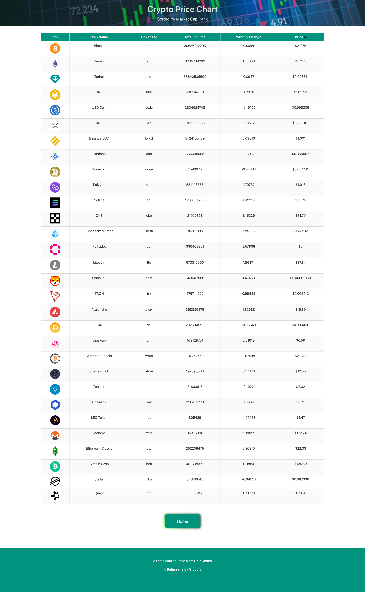

# Project-1
Group 3 - Kasen Brugh, Jillian Hallmark, Jonathan Dawkins, and Hannah Vaughan

## Description
This is a simple online currency converter that also includes current crypto prices. When the user is presented with the webpage, they are given the space to input an amount in USD to convert. They are then able to select from a drop-down which country’s currency they would like to convert to. Once the “Get Exchange Rate” button is clicked, then the conversion result is presented on the screen. When the user clicks the “Checkout Our Crypto Chart” button, they are taken to a second webpage that displays a chart of various cryptocurrencies and their prices. 

## Technologies Used
HTML, CSS, JavaScript 

## Visuals/Screenshots

.png)

## Installation

Open your default browser with the following link:

https://brughk.github.io/Project-1/
